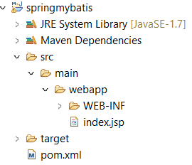

# CRUD with Spring + MyBatis

This is a simple web app for CRUD operation on a MySQL database using Spring MVC and MyBatis ORM.

## Initial Folder Structure

This is the standard folder structure that `Maven Project` provides.



## Setup

1. Go to <https://mvnrepository.com/>. Here, you can search all the dependencies.

2. Here, list of dependencies: Spring Web MVC(spring), junit(unit test), mybatis-spring(spring and mybatis integration), mybatis(mybatis), mysql-connector-java(mysql connector), jstl(jstl tag lib), c3p0 (For connection pool).

3. Update Project: Right Click Project Name -> Maven -> Update Project

4. Add JAVA runtime environment : Window -> Preferences and Add: `apache-tomcat-8` and `HTTP Server`

5. Create a new server by clicking on the `Click this link to create a new server` in the servers tab -> Use `Apache 8.0` server

## Steps ahead

1. Configure `Dispatcher` in `web.xml`.
2. Configure the servlets by creating servlet class inside `servletName-servlet.xml` files.
3. Create controler class and jsp. Create JSP files inside new `jsps` folder inside `WEB-INF` folder. Files: `list-employees.jsp` (to show list of employees). Create a Java folder inside main to keep all the java file.
4. Setup the database and a table inside it.
5. Create model class.
6. Add myBatis configuration file.
7. Read the config file in util class to start the factory session.
8. Create Mapper file, add select and insert queries.
9. Create table in JSP to display records.
10. 

## Tips

1. To format code: Ctrl + Shift + F

2. [Change Java Version of Maven Project](https://stackoverflow.com/a/28510029)

3. To view server tab: Window -> Show View -> Other -> Servers

## Terms

1. Dispatcher Servlet

So, `DispatcherServlet` handles an incoming HttpRequest, delegates the request, and processes that request according to the configured HandlerAdapter interfaces that have been implemented within the Spring application along with accompanying annotations specifying handlers, controller endpoints, and response objects.

It acts as the Front Controller for Spring-based web applications. This means that if any request that is going to come into our website the front controller is going to stand in front and is going to accept all the requests and once the front controller accepts that request then this is the job of the front controller that it will make a decision that who is the right controller to handle that request.

Configure `DispatcherServlet`:

- Open `web.xml` (Location: src->main->webapp->WEB-INF->web.xml)
- Copy and Paste the code given below:
```xml
<web-app id = "WebApp_ID" version = "2.4"
   xmlns = "http://JAVA.sun.com/xml/ns/j2ee" 
   xmlns:xsi = "http://www.w3.org/2001/XMLSchema-instance"
   xsi:schemaLocation = "http://java.sun.com/xml/ns/j2ee 
   http://java.sun.com/xml/ns/j2ee/web-app_2_4.xsd">
   <servlet>
        <servlet-name></servlet-name>
        <servlet-class></servlet-class>
        <load-on-startup></load-on-startup>
   </servlet>
   <servlet-mapping>
        <servlet-name></servlet-name>
        <url-pattern></url-pattern>
   </servlet-mapping>
</web-app>
```
- Create servletName-servlet.xml file to configure the servlets mentioned in the web.xml file.